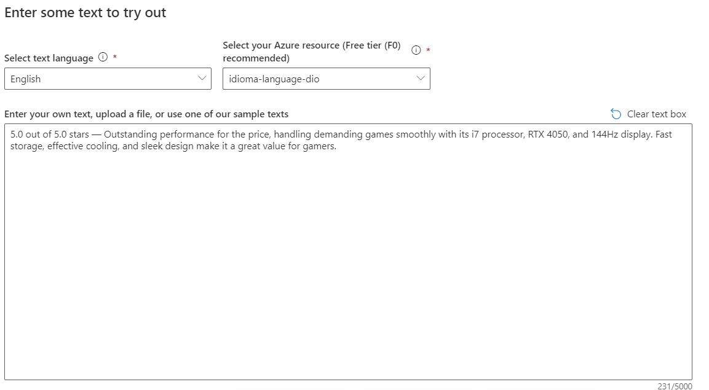
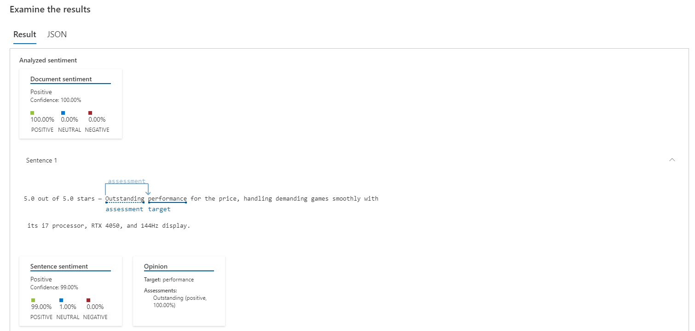
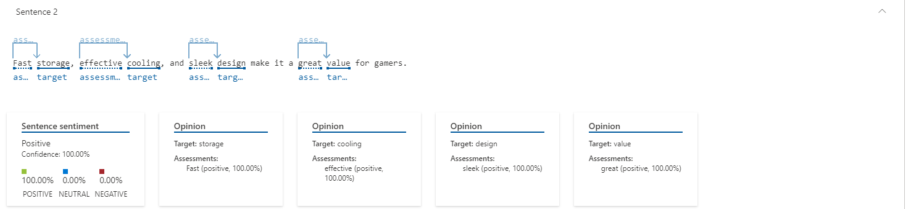
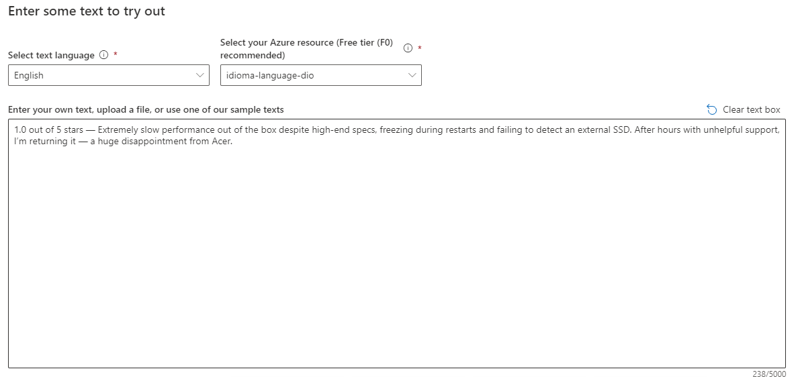
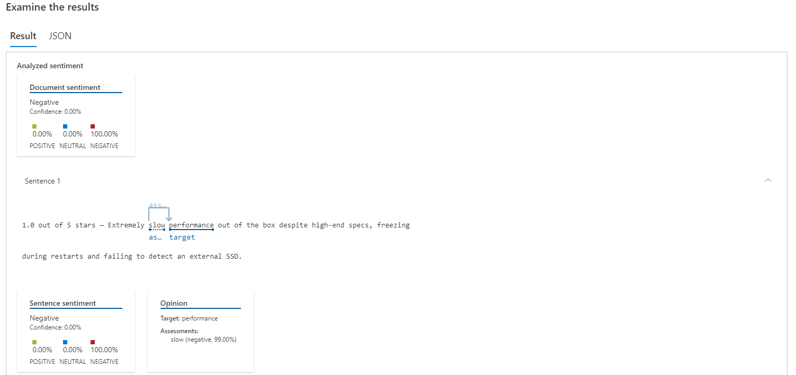

# Resumo - Aula de Análise de Sentimentos com Language Studio no Azure AI

Durante a aula de Análise de Sentimentos com Language Studio no Azure AI na DIO, foi apresentado como utilizar a ferramenta Language Studio, parte do conjunto de serviços do Azure AI, para realizar análises de sentimentos em textos. Essa análise permite identificar e classificar automaticamente emoções expressas em textos, como positivo, negativo ou neutro, além de fornecer uma pontuação de confiança para cada classificação.  

A ferramenta utiliza técnicas de Processamento de Linguagem Natural (PLN) e inteligência artificial, permitindo que empresas e desenvolvedores analisem opiniões de clientes, avaliações de produtos e interações em redes sociais de forma automatizada. Além disso, o Language Studio permite testar e explorar os serviços de linguagem da Azure de forma prática, sem a necessidade de codificação inicial.

A aula abordou também a criação de recursos de linguagem no portal do Azure e como esses recursos podem ser integrados em aplicações para monitoramento de reputação, feedback de usuários e suporte à tomada de decisões baseadas em dados textuais.

## Testes realizados

Entrada 1: 

Saídas:

Entrada 2: 

Saídas:

